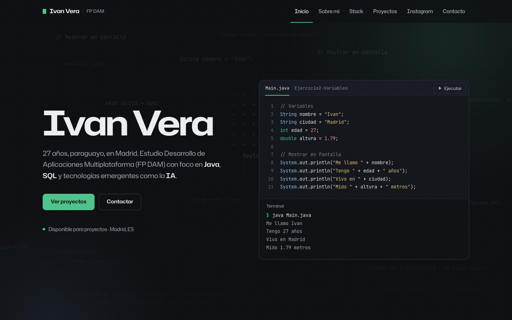
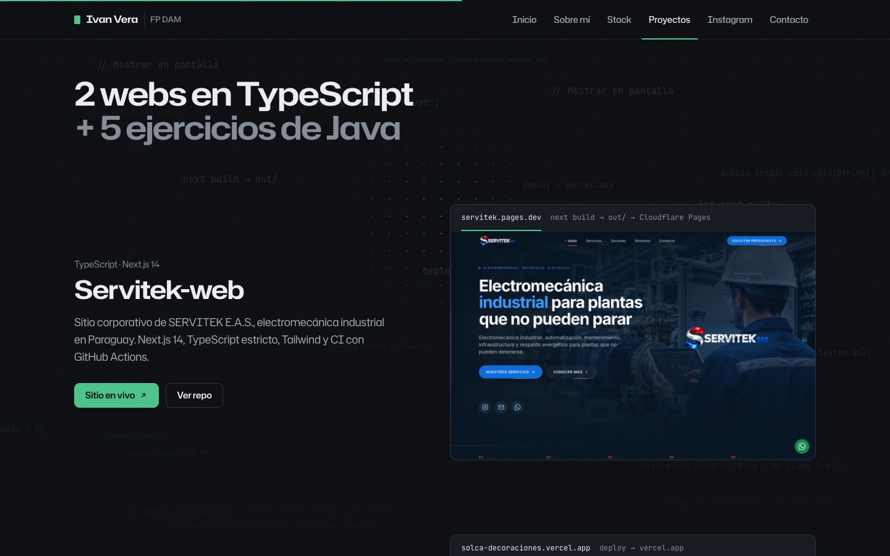

<div align="center">

# Iván Vera — Web personal

**Portafolio personal con la gramática de una documentación de referencia: prosa a la izquierda, código real a la derecha. Cero dependencias.**

[](https://ivanvera7.github.io/Ivanvera-web/)
[](https://developer.mozilla.org/es/docs/Web/HTML)
[](https://developer.mozilla.org/es/docs/Web/CSS)
[](https://developer.mozilla.org/es/docs/Web/JavaScript)
[](https://pages.github.com/)
[](#-ejecutar-en-local)

<br>

**[Web en vivo](https://ivanvera7.github.io/Ivanvera-web/)** · **[LinkedIn](https://www.linkedin.com/in/ivanvera7/)** · **[Instagram](https://www.instagram.com/ivanvera7_/)** · **[GitHub](https://github.com/ivanvera7)** · **[Email](mailto:ivan99vera1@gmail.com)**



</div>

---

## 📄 Sobre el proyecto

Sitio personal **estático** (HTML + CSS + JavaScript) que presenta mi perfil, mi
formación en **FP DAM**, mi stack y mis proyectos, con un feed de Instagram
incrustado y vías de contacto directo.

- **Sin frameworks ni build**: no hay `package.json`, ni `npm install`, ni paso de
  compilación. Lo que ves en los tres archivos es lo que se sirve.
- **Autocontenido**: la única llamada externa son los *embeds* oficiales de Instagram.
- **Publicado en GitHub Pages**: cada `push` a `main` vuelve a desplegarse solo.

## ✨ Características

| Área | Detalle |
| --- | --- |
| **Diseño** | Fondo oscuro con un único acento verde. Tipografías autoalojadas: **Hubot Sans** (de GitHub) y **JetBrains Mono** (de IntelliJ). Sistema documentado en [`DESIGN.md`](DESIGN.md). |
| **Paneles de código** | Todo el código mostrado es real, sacado de mis repos, con resaltado de sintaxis propio y números de línea. |
| **Interacción** | El programa de *Variables* del hero se ejecuta y muestra su salida; los 5 ejercicios de Java se exploran como pestañas; botones para copiar el email y los datos. |
| **Proyectos** | Capturas reales de las dos webs publicadas (Servitek y Solca). |
| **Responsive** | Un único módulo prosa \| panel que pasa a una columna en `900px`; menú desplegable en `760px`; ajustes finos en `560px`. |
| **Accesibilidad** | HTML semántico, contraste AA, *skip link*, foco visible, pestañas ARIA con teclado, menú móvil con Esc, contenido legible sin JavaScript y soporte de `prefers-reduced-motion`. |
| **SEO / Social** | `title`, `meta description`, `theme-color`, Open Graph y Twitter Card, favicon + apple-touch-icon. |
| **Rendimiento** | Imágenes optimizadas y con `loading="lazy"`, sin librerías externas, CSS y JS sin procesar. |

### Movimiento

1. **Fondo de programación**: rejilla de puntos, fragmentos de mi código real cayendo en tres profundidades (canvas) y una luz verde que sigue al cursor.
2. **Máquina de escribir** en el nombre y luz aurora suave en el hero.
3. **Programas ejecutables**: el hero y los 5 ejercicios de Java escriben `java Main.java` y muestran su salida real; el de `Scanner` te pide el nombre y te saluda.
4. Títulos que aparecen letra a letra y bloques que entran al hacer scroll.
5. Barras de nivel con contador, barra de progreso de lectura y subrayado del menú con *scrollspy*.
6. Capturas de proyectos con inclinación 3D y reflejo que sigue al ratón.
7. Microinteracciones: pulsación de botones, flechas externas, confirmación de «Copiado».

> El fondo se pausa con la pestaña oculta y va a 30 fps en móvil. Con
> «movimiento reducido» no hay desplazamientos: todo aparece ya completo.

<div align="center">

<br>
<sub>Proyectos · capturas reales de las webs publicadas</sub>
</div>

## 📁 Estructura

```text
Ivanvera-web/
├── index.html          # Estructura y todos los contenidos
├── styles.css          # Sistema visual, componentes y responsive
├── script.js           # Resaltado, ejecución del hero, pestañas, copiar, nav (IIFE, vanilla JS)
├── PRODUCT.md          # A quién va dirigida la web y qué no se debe inventar
├── DESIGN.md           # Sistema de diseño (tokens, tipografía, componentes)
├── assets/
│   ├── avatar.jpg      # Foto de perfil (también usada como og:image)
│   ├── fonts/          # Hubot Sans y JetBrains Mono (woff2 + licencias OFL)
│   ├── projects/       # Capturas de Servitek y Solca
│   └── logos/          # SVG de las herramientas del stack
├── favicon/
│   ├── favicon.svg             # Icono de pestaña (vectorial)
│   ├── favicon-32.png          # Respaldo PNG 32×32
│   ├── favicon.png             # Versión grande (512×512)
│   └── apple-touch-icon.png    # Icono para iOS (180×180)
├── docs/
│   ├── preview.jpg             # Captura del hero (este README)
│   ├── preview-stack.jpg       # Captura del apartado de proyectos
│   └── superpowers/specs/      # Especificación de diseño
└── .gitignore
```

## 🛠 Stack

- **HTML5** semántico
- **CSS3**: variables, grid/flex, `clamp()`, fuentes variables (peso y anchura), `@font-face` autoalojado
- **JavaScript ES6+** sin dependencias (DOM, `IntersectionObserver`, `requestAnimationFrame`)
- **Embeds oficiales de Instagram** (`instagram.com/embed.js`)

### Iconos y favicon

- **Logos del stack**: [Devicon](https://devicon.dev/), [Simple Icons](https://simpleicons.org/), [Lucide](https://lucide.dev/) y el SVG oficial de opencode — servidos como archivos locales en `assets/logos/` (la web no hace peticiones a CDNs en tiempo de ejecución).
- **Favicon**: `>` y el bloque verde del logo sobre una pieza oscura, dibujado en SVG (`favicon/favicon.svg`) con la paleta de la web.

| Archivo | Uso | Tamaño |
| --- | --- | --- |
| `favicon/favicon.svg` | Icono de pestaña principal (`rel="icon"`, vectorial) | < 1 KB |
| `favicon/favicon-32.png` | Respaldo para navegadores sin SVG | 32×32 |
| `favicon/favicon.png` | Versión grande del icono | 512×512 · ~12 KB |
| `favicon/apple-touch-icon.png` | Icono táctil en iOS (sin esquinas: iOS las redondea) | 180×180 |

## 🚀 Ejecutar en local

No hay instalación: solo hace falta un servidor estático (los *embeds* de
Instagram **no cargan** si abres el archivo con `file://`).

```bash
git clone https://github.com/ivanvera7/Ivanvera-web.git
cd Ivanvera-web
python3 -m http.server 8099
```

Abre **http://localhost:8099**

> Cualquier otro servidor sirve: `npx serve`, `php -S localhost:8099`, etc.

## 🌐 Despliegue

La web está publicada en **GitHub Pages** desde la rama `main` (raíz del repo):

**https://ivanvera7.github.io/Ivanvera-web/**

Para publicar cambios:

```bash
git add .
git commit -m "Descripción del cambio"
git push origin main
```

GitHub Pages reconstruye el sitio automáticamente (1–2 minutos).

## 🗂 Proyectos incluidos

| # | Proyecto | Stack | Repositorio | En vivo |
| - | -------- | ----- | ----------- | ------- |
| 01 | Hola Mundo | Java | [repo](https://github.com/ivanvera7/Ejercicio1-HolaMundo) | — |
| 02 | Variables | Java | [repo](https://github.com/ivanvera7/Ejercicio2-Variables) | — |
| 03 | Sumar | Java | [repo](https://github.com/ivanvera7/Ejercicio3-Sumar) | — |
| 04 | Calculadora | Java | [repo](https://github.com/ivanvera7/Ejercicio4-Calculadora) | — |
| 05 | Info de usuario | Java | [repo](https://github.com/ivanvera7/Ejercicio5-Info-de-usuario) | — |
| 06 | Servitek-web | Next.js · TypeScript · Tailwind | [repo](https://github.com/ivanvera7/servitek-web) | [servitek.pages.dev](https://servitek.pages.dev) |
| 07 | Solca Decoraciones | React · TypeScript | [repo](https://github.com/ivanvera7/Solca-decoraciones) | [solca-decoraciones.vercel.app](https://solca-decoraciones.vercel.app) |

## ✏️ Personalización

| Qué cambiar | Dónde |
| --- | --- |
| Textos, proyectos, enlaces y embeds | `index.html` |
| Colores, tipografía y animación CSS | `styles.css` → bloque `:root` (documentado en `DESIGN.md`) |
| Comportamiento de las animaciones | `script.js` |
| Foto de perfil | `assets/avatar.jpg` (misma usada en `og:image`) |
| Logos del stack | `assets/logos/*.svg` (lista en `index.html` → `.tools`) |
| Favicon | `favicon/favicon.svg` → regenerar los PNG de `favicon/` a partir de él |
| Contacto (email / LinkedIn / WhatsApp / Instagram / GitHub) | `index.html` → sección `#contacto` |

## 📬 Contacto

- **Email:** [ivan99vera1@gmail.com](mailto:ivan99vera1@gmail.com)
- **LinkedIn:** [in/ivanvera7](https://www.linkedin.com/in/ivanvera7/)
- **WhatsApp:** [+34 683 224 002](https://wa.me/34683224002)
- **Instagram:** [@ivanvera7_](https://www.instagram.com/ivanvera7_/)
- **GitHub:** [@ivanvera7](https://github.com/ivanvera7)

---

<div align="center">
<sub>© 2026 Iván Vera · Madrid · Hecho con HTML, CSS, JS y Claude.</sub>
</div>
